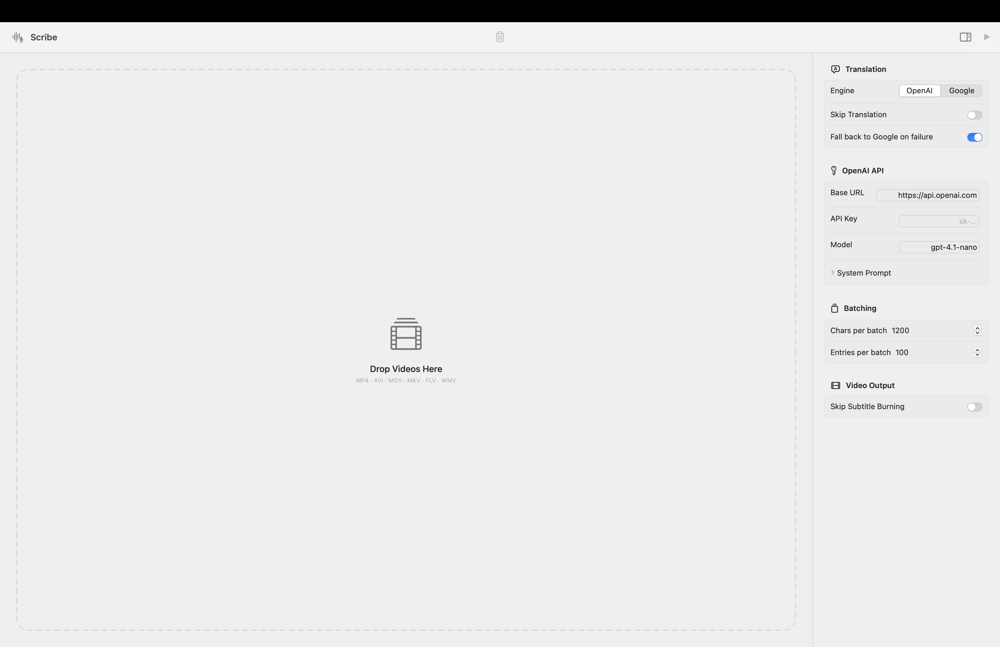

<div align="center">

# Scribe

**Transcribe, translate, and burn bilingual subtitles into videos — 100% on your Mac.**

Your audio never leaves the device. Your translations run on the API you choose.

[](https://github.com/itchat/Scribe/actions/workflows/ci.yml)
[](LICENSE)


</div>

---

## What it does

Drop a video in. Get back the same video with burned-in English + Chinese subtitles. The whole pipeline is local except for the translation API call of your choice.

```
video.mp4  →  audio.wav  →  transcript  →  translated SRT  →  subtitled video
              (ffmpeg)      (Parakeet      (OpenAI or       (ffmpeg + libass)
                            on ANE)         Google)
```

<p align="center">
  
  <br>
  <sub><em>Drop videos, pick an engine, hit Start. Settings live in the native Inspector.</em></sub>
</p>

## Why I built it

I had a Python prototype using PyQt6 + MLX that shipped as a **~200 MB** PyInstaller bundle with a 3-second cold start and a UI that felt Linux-y on macOS. I wanted to see how far a modern Swift rewrite could go if it followed SOLID strictly and shipped a native UI.

**Result:** same feature set, **8.3 MB** binary, **sub-second launch**, 100% native UI.

## The numbers

| | Python (original) | Swift (Scribe) | |
|---|---:|---:|---:|
| Source LOC | ~7,400 | ~2,900 | **−60%** |
| App binary | ~200 MB | **8.3 MB** | **−95%** |
| Cold launch | 2–5 s | **< 0.5 s** | |
| ASR runtime | MLX (GPU) | CoreML on Neural Engine |  |
| Tests | 0 | **115** across 19 suites |  |
| External dependencies | 6 | **1** (FluidAudio) | |

## Pair-programmed with Claude Code

Scribe was built end-to-end with **[Claude Code](https://claude.com/claude-code)** (Opus 4.7 · 1M context) as an experiment in AI pair programming. I drove the product decisions and reviewed every change; Claude wrote most of the code, suggested refactors, and caught its own SOLID violations when I asked for an audit.

The build followed strict **Red → Green → Refactor TDD**: 115 tests across 19 suites were written before the implementation they test. When the audit flagged `ProcessingViewModel` for juggling five responsibilities and a Dependency Inversion violation, the refactor split it into four focused services without breaking a single test.

## Architecture

```
UI (SwiftUI)
   │
   ▼
Core (pipeline, parsers, orchestration)
   │
   ▼
Protocols ◄── Infrastructure (FFmpeg, FluidAudio, OpenAI, Google)
   │
   ▼
Domain (pure value types · zero imports)
```

Five SPM targets with strictly unidirectional dependencies. Zero singletons. The composition root assembles concrete types **exactly once** per pipeline run, so every component is replaceable and every layer is independently testable.

## Features

### Speech recognition (local)
- **Parakeet TDT 0.6B v2**, English-only, via [FluidAudio](https://github.com/FluidInference/FluidAudio)
- CoreML on the **Apple Neural Engine**
- ~120× realtime on an M4 Pro
- Model auto-downloads on first use (~1.2 GB, cached afterwards)

### Translation
- **OpenAI**-compatible APIs (OpenAI, OpenRouter, Azure, local proxies — anything that speaks `/v1/chat/completions`)
- **Google Translate** free endpoint (no API key)
- **Decorator-pattern fallback**: if OpenAI fails, try Google; if both fail, keep originals
- Smart batch splitting with a multi-strategy separator-recovery heuristic for malformed responses

### Video
- Audio extraction with optional **VideoToolbox** hardware acceleration
- Subtitle burn-in via FFmpeg's `subtitles` filter + `libass`
- Bilingual SRT side-car (`_en.srt`, `_bi.srt`)
- `ffmpeg-full` bundled in the release DMG so users never have to install it

### Native macOS UI
- SwiftUI `.toolbar`, `.inspector`, `.dropDestination`, `.regularMaterial`
- Drag `.mp4` in, drag the finished `.mp4` back out to Finder
- Video thumbnails, duration, resolution, file size (via `AVAssetImageGenerator`)
- **Settings auto-apply** — same as Xcode Attributes Inspector, Keynote Format panel, Finder Get Info
- System notifications on completion, transient toasts for in-session feedback
- Custom app icon, true fullscreen, keyboard-first

### Keyboard shortcuts
| | |
|---|---|
| `⌘O` | Open videos |
| `⌘R` | Start processing |
| `⌘,` | Toggle settings |
| `⌘Q` | Quit |

## Install

### From release

1. Download `Scribe-<version>.dmg` from the [Releases page](https://github.com/itchat/Scribe/releases)
2. Open the DMG, drag **Scribe** to Applications
3. First launch: right-click → **Open** (the build is ad-hoc signed, so Gatekeeper needs explicit permission once)

### From source

```bash
git clone https://github.com/itchat/Scribe.git
cd Scribe
brew install ffmpeg-full        # needs libass for subtitle burning
swift run Scribe                # dev run
./scripts/build-app.sh --dmg    # package .app + .dmg into dist/
```

**Requirements:** macOS 14 (Sonoma) or later, Apple Silicon (M1+).

## Design highlights

A few pieces I'm happy with:

**Pipeline is pure orchestration.** `VideoPipeline` has six injected protocol dependencies and knows nothing about FFmpeg, OpenAI, or CoreML. Swapping any implementation — or inserting a fake for tests — is a one-line change at the composition root.

**Translator is a decorator.** `FallbackTranslator(primary: openAI, fallback: google)` conforms to the same protocol as its children. You can nest it arbitrarily without touching the pipeline.

**FFmpeg is three small types, not one big one.** A `Locator` that finds the binary, a `CommandBuilder` (pure functions, 100% unit-testable), and a `ProcessRunner` with timeout + stderr handling. Extractor and Probe each pick what they need — ISP in practice.

**Auto-save settings.** The Inspector has no Apply button. Every `Toggle` change calls `onSave` directly. TextFields commit on blur or Return. It's what native macOS apps actually do, and it removes a whole class of "did I forget to save?" bugs.

**Error handling is a single enum.** `ScribeError` has ~15 cases, each carrying just the data that case needs. One switch in the pipeline decides whether to retry, surface the error, or fail softly — no exception hierarchy, no `Any` casts.

## Tech stack

- **SwiftUI** (macOS 14+) with Swift 6 concurrency (`async/await`, `actor`)
- **[FluidAudio](https://github.com/FluidInference/FluidAudio)** — CoreML Parakeet
- **[FFmpeg](https://ffmpeg.org/)** (subprocess) — audio + video
- **[swift-testing](https://github.com/swiftlang/swift-testing)** — all 115 tests
- **URLSession** for HTTP; **Codable** + JSON for config persistence (`~/Library/Application Support/Scribe/`)

## Project layout

```
Scribe/
├── Package.swift                  # 5 targets, strict dependency graph
├── Sources/
│   ├── Domain/                    # value types, zero imports
│   ├── Protocols/                 # 7 small interfaces
│   ├── Core/                      # pipeline, parsers, retry, batch
│   ├── Infrastructure/            # FFmpeg, ASR, translation, config
│   └── App/                       # SwiftUI views + ViewModels + Services
├── Tests/
│   ├── UnitTests/
│   └── IntegrationTests/
├── scripts/
│   ├── build-app.sh               # release → .app → DMG
│   └── make-icon.sh               # regenerate the app icon from SF Symbols
├── .github/workflows/             # CI on push; Release on tag
└── Resources/                     # Info.plist, AppIcon.icns
```

## Releasing

```bash
git tag v1.0.0
git push origin v1.0.0
```

GitHub Actions tests → builds → attaches `Scribe-v1.0.0.app.zip` + `Scribe-v1.0.0.dmg` to the release.

## License

MIT. See [LICENSE](LICENSE).

---

<div align="center">
<sub>Built by <a href="https://github.com/itchat">@itchat</a> with <a href="https://claude.com/claude-code">Claude Code</a> (Opus 4.7 · 1M context).</sub>
</div>
